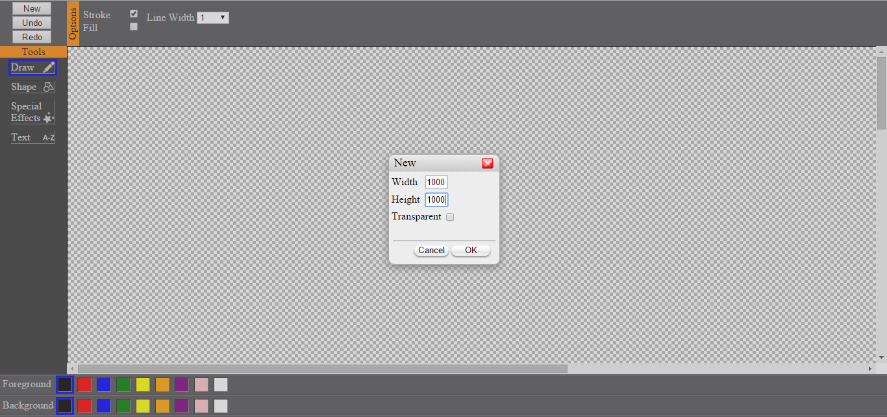
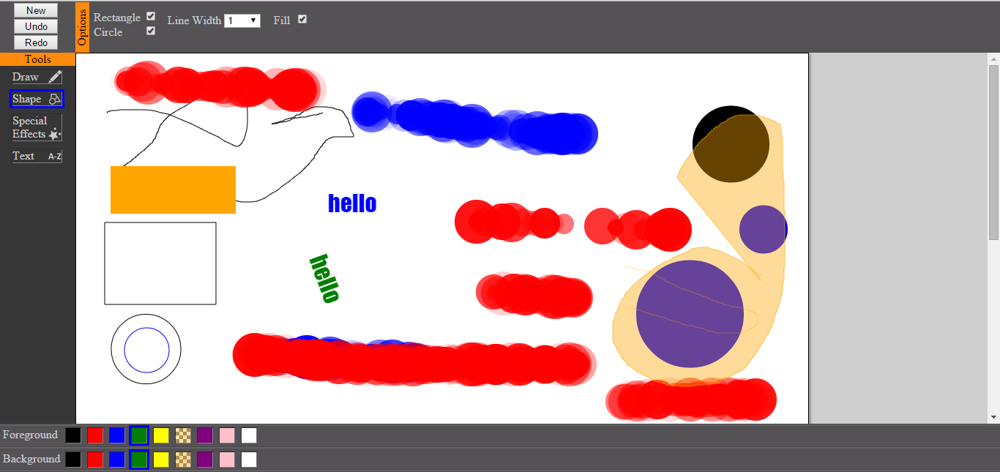
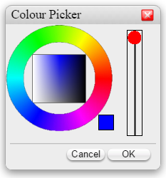

Paint Program
========

I created a paint program application to experiment with html canvas for the first time. They is lots more i could and possibly will add to
it. It is created in a way whereby adding new tools wouldn't be to difficult to do.

* Has undo and redo buttons for undoing and redoing your work.
* You can create a new image by clicking on the 'new' button, where you type in the width and height of the image you want and
  tick whether or not you want the background to be transparent.
* Uses double buffering.
* Has colour picker in a dialog, along with a transparency slider.
* Tools available:
    1. draw tool with fill and stroke options and line width options.
    2. shape tool with rectangle, circle, line width and fill options.
    3. text tool with options to change font, font size and rotation of text.

